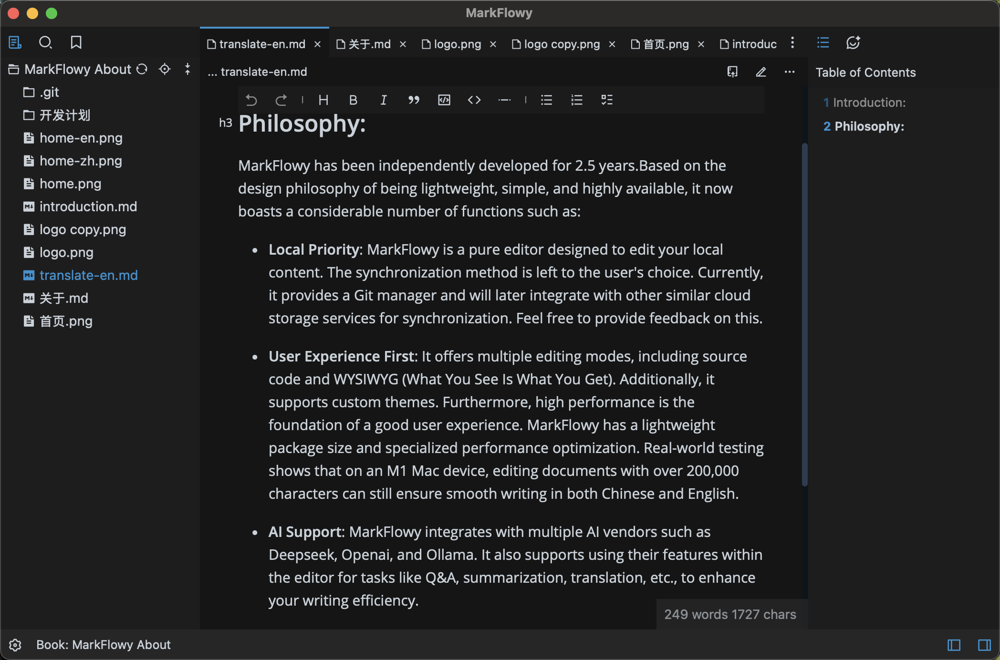

  

<h2 align="center"/>MarkFlowy <em>beta</em></h2>

 
<em>Modern and intelligent Markdown editor.</em>
 
 

[![Build Status][build-badge]][build]
[![App Version][version-badge]][release]
[![Downloads][downloads-badge]][release]
 
[![PRs Welcome][prs-welcome-badge]][prs-welcome]
[![MIT License][license-badge]][license]
[![Code of Conduct][coc-badge]][coc]
[![codefactor]](https://www.codefactor.io/repository/github/drl990114/markflowy)
 
[![TypeScript-version-icon]](https://www.typescriptlang.org/)
[![Rust-version-icon]](https://www.rust-lang.org/)

 
[![Commit Activity][commit-badge]][commit]
[![issues-closed]](https://github.com/drl990114/MarkFlowy/issues?q=sort%3Aupdated-desc+is%3Aissue+is%3Aclosed)

<h4 align="center"><strong>English</strong> | <a href="./README_CN.md">简体中文</a></h4>

## MarkFlowy is in Beta Stage ⚠️

Currently, MarkFlowy is in the beta stage, and it is recommended to use it with data backups.

## Features

- **Built-in AI**. Currently, it supports one click export of conversations, translation of articles to any language, and obtaining article abstracts. It also supports large models such as `DeepSeek` and `Chatgpt` to make them your intelligent assistants.
- **Super lightweight**. The MarkFlowy is based on tauri and has a volume of less than 10MB and better performance.
- **High availability**. MarkFlowy uses the remirror editor, which not only provides high scalability, but also has a great editing experience. And, MarkFlowy supports multiple editing modes, such as `source code`, `wysiwyg`.
- **Custom Theme**. MarkFlowy supports custom themes, and you can also share your themes with others.

## Download

Available for Linux, macOS and Windows.

> [!NOTE]
> Because of Apple’s security policy restrictions on software without developer certification, the **macOS aarch64** version cannot be downloaded and used directly. You can ignore the limit by doing the following:
> - Open your terminal
> - Go to the `Applications` directory. .e.g `/Applications`.
> - Run `xattr -cr MarkFlowy.app` and open the app again
> - Please make sure you download from `github releases` or [UpgradeLink](https://download.upgrade.toolsetlink.com/download?appKey=xpn68m4j5qU0Y1rfDYFHaA).

You can download it from the [UpgradeLink download page](https://download.upgrade.toolsetlink.com/download?appKey=xpn68m4j5qU0Y1rfDYFHaA) or [GitHub Release](https://github.com/drl990114/MarkFlowy/releases)

## Why
At present, I have used many Markdown applications, but I have not encountered one that is very suitable for me. I have always hoped to have a Markdown editor that is efficient, beautiful, lightweight, data-safe, and can be easily combined with various workflows. This It is also the original intention of doing MarkFlowy.

## Contribute

The current MarkFlowy is still in its infancy, and there may be some bad experiences or bugs, for which I am sorry. All partners who are interested or encounter usage problems are welcome to submit [issues](https://github.com/drl990114/MarkFlowy/issues/new) or [PR](https://github.com/drl990114/MarkFlowy/compare) to participate in this project.

### How to Contribute

You can read [CONTRIBUTING](./docs/en/Community/CONTRIBUTING.md) to know how to start the project and modify the code, Welcome to participate in code contribution.

## Support

MarkFlowy is completely and permanently open source, if you want to support MarkFlowy, you can `star` this project. For special support, please contact me via [email](mailto:drl990114@gmail.com).

In addition, you can sponsor me through WeChat or Alipay, which will greatly encourage me. And it will also be used for the subsequent development of the project, such as expenses for servers, domains, etc

[Sponsor](https://drl990114.github.io/sponsor)

| WeChat appreciates | Alipay appreciates |
| :-: | :-: |
|   <small>Let's have a bottle of wine~</small> |   <small>Have a cup of coffee~</small> |

## Sponsors

## Contributors

The development of **MarkFlowy** cannot be separated from these contributors. They have contributed a lot of abilities to **MarkFlowy**. Meanwhile, welcome to follow them! ❤️

<!-- readme: contributors -start -->
<table>
<tr>
    <td align="center">
        <a href="https://github.com/drl990114">
            
             
            <b>Drl990114</b>
        </a>
    </td>
    <td align="center">
        <a href="https://github.com/AdySnowflake">
            
             
            <b>Null</b>
        </a>
    </td>
    <td align="center">
        <a href="https://github.com/SamDc73">
            
             
            <b>Husam Alshehadat</b>
        </a>
    </td>
    <td align="center">
        <a href="https://github.com/marianoesteban">
            
             
            <b>Mariano Esteban</b>
        </a>
    </td>
    <td align="center">
        <a href="https://github.com/Raven-1027">
            
             
            <b>Null</b>
        </a>
    </td>
    <td align="center">
        <a href="https://github.com/chiefass">
            
             
            <b>Chiefass</b>
        </a>
    </td>
    <td align="center">
        <a href="https://github.com/fossabot">
            
             
            <b>Fossabot</b>
        </a>
    </td></tr>
<tr>
    <td align="center">
        <a href="https://github.com/punkyard">
            
             
            <b>Pun Kyard</b>
        </a>
    </td></tr>
</table>
<!-- readme: contributors -end -->

<!-- badges -->
[build-badge]: https://img.shields.io/github/actions/workflow/status/drl990114/MarkFlowy/nodejs.yml.svg?style=flat-square
[build]: https://github.com/drl990114/MarkFlowy/actions/workflows/nodejs.yml
[downloads-badge]:  https://img.shields.io/github/downloads/drl990114/MarkFlowy/total?label=downloads&style=flat-square
[license-badge]: https://img.shields.io/badge/license-AGPL-purple.svg?style=flat-square
[license]: https://opensource.org/licenses/AGPL-3.0
[release]: https://github.com/drl990114/MarkFlowy/releases
[prs-welcome-badge]: https://img.shields.io/badge/PRs-welcome-brightgreen.svg?style=flat-square
[prs-welcome]: https://github.com/drl990114/MarkFlowy/blob/main/CONTRIBUTING.md
[coc-badge]: https://img.shields.io/badge/code%20of-conduct-ff69b4.svg?style=flat-square
[coc]: https://github.com/drl990114/MarkFlowy/blob/main/CODE_OF_CONDUCT.md
[commit-badge]: https://img.shields.io/github/commit-activity/m/drl990114/MarkFlowy?color=%23ff9900&style=flat-square
[commit]: https://github.com/drl990114/MarkFlowy
[version-badge]: https://img.shields.io/github/v/release/drl990114/MarkFlowy?color=%239accfe&label=version&style=flat-square
[rust-version-icon]: https://img.shields.io/badge/Rust-1.85.0-dea584?style=flat-square
[typescript-version-icon]: https://img.shields.io/github/package-json/dependency-version/drl990114/MarkFlowy/dev/typescript?label=TypeScript&style=flat-square
[codefactor]: https://www.codefactor.io/repository/github/drl990114/markflowy/badge/main?style=flat-square
[issues-closed]: https://img.shields.io/github/issues-closed/drl990114/MarkFlowy.svg?style=flat-square

## License

