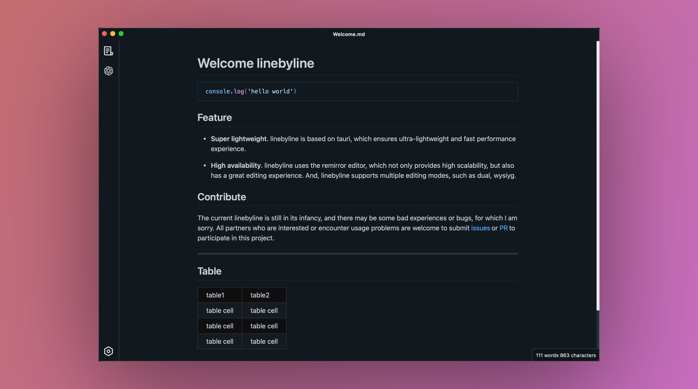
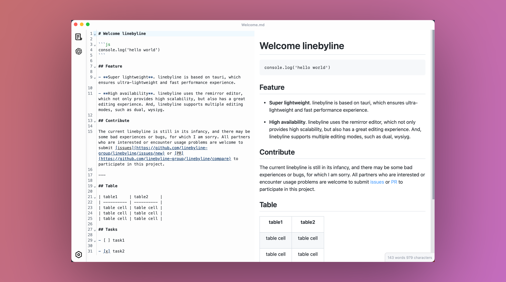

<h4 align="right"><strong>English</strong> | <a href="./README_CN.md">简体中文</a></h4>

  

<h1 align="center"/>LineByLine <em>alpha</em></h1>

<h4 align="center">Modern markdown editor.(WIP)</h3>

  
  
  
  
  

## ⚠️ LineByLine is in Alpha

Currently, LineByLine is still in the alpha phase, and it is recommended to use it when there is data backup available.

## Feature

- **Built-in ChatGpt**. Currently supports one-click export of conversations, making chatgpt your smart assistant.
- **Super lightweight**. The linebyline is based on tauri and has a volume of less than 10MB and better performance.
- **High availability**. linebyline uses the remirror editor, which not only provides high scalability, but also has a great editing experience. And, linebyline supports multiple editing modes, such as `dual`, `wysiyg`.

## Download

Available for Linux, macOS and Windows.

Please look [releases page](https://github.com/linebyline-group/linebyline/releases)

## Why
At present, I have used many Markdown applications, but I have not encountered one that is very suitable for me. I have always hoped to have a Markdown editor that is efficient, beautiful, lightweight, data-safe, and can be easily combined with various workflows. This It is also the original intention of doing linebyline.

## Contribute

The current linebyline is still in its infancy, and there may be some bad experiences or bugs, for which I am sorry. All partners who are interested or encounter usage problems are welcome to submit [issues](https://github.com/linebyline-group/linebyline/issues/new) or [PR](https://github.com/linebyline-group/linebyline/compare) to participate in this project.

### How to Contribute

You can read [CONTRIBUTING](./CONTRIBUTING.md) to know how to start the project and modify the code, Welcome to participate in code contribution.

## Support

linebyline is completely and permanently open source, if you want to support line byline, you can `star` this project. This will give me great support and help, love you.

## Thanks

- <a href="https://github.com/tauri-apps/tauri" target="_blank">Tauri</a> - A framework for building cross-platform applications that provides linebyline with a solid foundation.
- <a href="https://github.com/facebook/react" target="_blank">React</a> - Web user interface framework.
- <a href="https://github.com/remirror/remirror" target="_blank">Remirror</a> - The ProseMirror toolkit for React, on which the linebyline editor is based.
- <a href="https://github.com/ocavue/rino" target="_blank">Rino</a> - Some initialization codes of package/editor come from here.
- <a href="https://github.com/vitejs/vite" target="_blank">Vite</a> - front-end build tool.

## ScreenShot

### index

### Dark Mode

### Dual Mode

### One-click export chatgpt conversation

