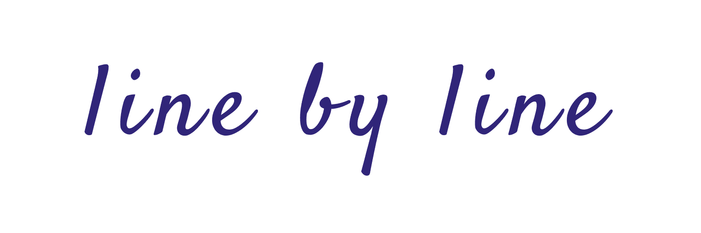
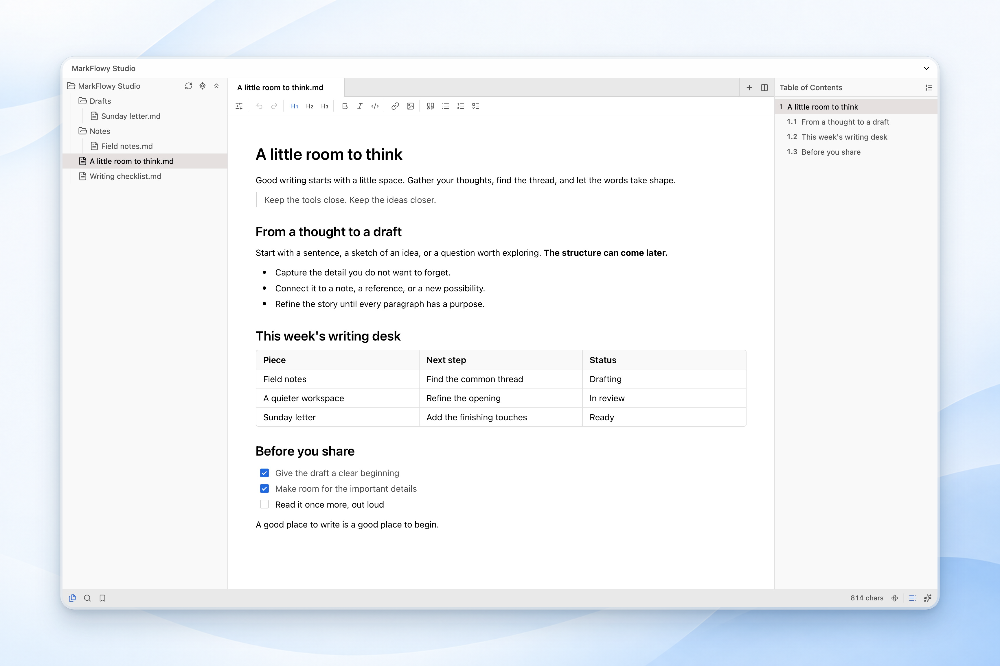
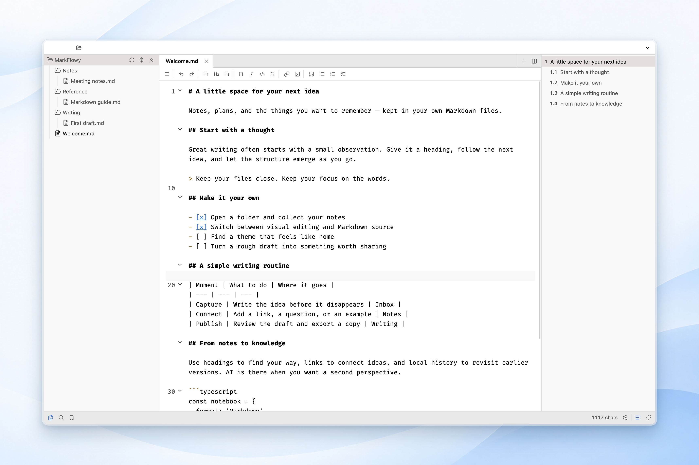
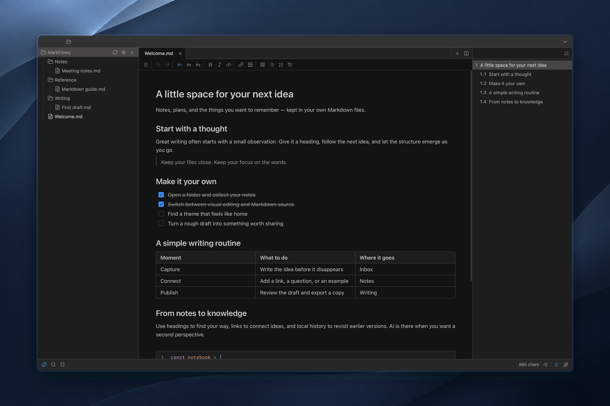

<!--@nrg.languages=en,zh,ja-->
<!--@nrg.defaultLanguage=en-->
<!--@nrg.fileNamePattern.zh=README_CN.md-->
<!--@nrg.fileNamePattern.ja=README_JA.md-->

<div align="center"><!--en-->
  <!--en-->
</div><!--en-->
<!--en-->
<h1 align="center">MarkFlowy</h1><!--en-->
<div align='center'><!--en-->
<br><!--en-->
<em>Write with ease. Stay in flow.</em><!--en-->
<br><!--en-->
<br><!--en-->
</div><!--en-->
<!--en-->
<div align="center"><!--en-->
<!--en-->
[](https://github.com/drl990114/MarkFlowy)<!--en-->
[](https://atomgit.com/drl990114/MarkFlowy)<!--en-->
[![App Version][version-badge]][release]<!--en-->
[![Downloads][downloads-badge]][release]<!--en-->
<br/><!--en-->
[![Build Status][build-badge]][build]<!--en-->
[![Code of Conduct][coc-badge]][coc]<!--en-->
[![Commit Activity][commit-badge]][commit]<!--en-->
[![issues-closed]](https://github.com/drl990114/MarkFlowy/issues?q=sort%3Aupdated-desc+is%3Aissue+is%3Aclosed)<!--en-->
<br/><!--en-->
[![PRs Welcome][prs-welcome-badge]][prs-welcome]<!--en-->
[![TypeScript-version-icon]](https://www.typescriptlang.org/)<!--en-->
[![Rust-version-icon]](https://www.rust-lang.org/)<!--en-->
[![License][license-badge]][license]<!--en-->
[![codefactor]](https://www.codefactor.io/repository/github/drl990114/markflowy)<!--en-->
<!--en-->
<!--en-->
<br/><!--en-->
</div><!--en-->
<!--en-->
<h4 align="center"><strong>English</strong> | <a href="./README_CN.md">简体中文</a> | <a href="./README_JA.md">日本語</a></h4><!--en-->
<!--en-->
MarkFlowy is a local-first Markdown editor for **macOS, Windows, and Linux**. Write visually or in source, organize your own folders, and bring in AI when it helps. Local editing works without an account or an AI provider.<!--en-->
<!--en-->
[Download](https://github.com/drl990114/MarkFlowy/releases/latest) · [Website](https://www.markflowy.cc) · [User guide](./docs/en/intro.md) · [Release notes](./apps/desktop/UPDATE_LOG.md)<!--en-->
<!--en-->
<!--en-->
<!--en-->
## Features<!--en-->
<!--en-->
- **Write your way.** Switch between visual editing, Markdown source, and reading mode. Work with tables, task lists, code, math, Mermaid diagrams, and reusable snippets. Use Zen mode when you want to focus.<!--en-->
- **High-performance editing.** Optimized loading and rendering make large Markdown documents easier to open, scroll through, and edit.<!--en-->
- **Stay in your own folders.** Open individual files or a workspace, organize the file tree, use tabs and split editors, and navigate with bookmarks and an outline. Quick Open and workspace search help you return to an idea.<!--en-->
- **Revisit your work.** Compare local history, recover saved drafts after a normal exit or reload, and handle changes made by other applications. Local history complements your own backups.<!--en-->
- **Make it feel right.** Choose light or dark themes, create themes with the visual editor, customize shortcuts and typography, and set automatic, left-to-right, or right-to-left document text direction.<!--en-->
- **Use AI on your terms.** Chat, summarize, translate, or enable Copilot with your configured provider: OpenAI-compatible services, DeepSeek, Google, or Ollama. Chat and Copilot have separate model settings. See the [Ollama guide](./docs/en/Extension/UseCopilotWithOllama.md).<!--en-->
- **Share your writing.** Export HTML or images, print to PDF, or install Pandoc for DOCX, ODT, and EPUB. The [CLI](./docs/CLI.md) supports local file and export automation.<!--en-->
<!--en-->
Cloud AI and remote endpoints receive the context sent to them. Local inference requires a local Ollama endpoint **and** a local model.<!--en-->
<!--en-->
## A closer look<!--en-->
<!--en-->
<!--en-->
<!--en-->
<!--en-->
<!--en-->
## Get started<!--en-->
<!--en-->
1. Install a package for your platform from [GitHub Releases](https://github.com/drl990114/MarkFlowy/releases/latest).<!--en-->
2. Open a Markdown file, or open a folder as a workspace.<!--en-->
3. Choose an editing mode from the editor's **More** menu. Use **Cmd/Ctrl + P** for Quick Open and **Cmd/Ctrl + Shift + P** for commands.<!--en-->
4. Adjust appearance and shortcuts in **Settings**. Configure AI only if you want to use it.<!--en-->
<!--en-->
The [user guide](./docs/en/intro.md) covers editing, search, history, export, and common shortcuts. The separate Web App Beta has its own storage and workspace behavior; these screenshots and instructions describe Desktop.<!--en-->
<!--en-->
## Download<!--en-->
<!--en-->
Available for Windows, macOS and Linux, from the [latest release](https://github.com/drl990114/MarkFlowy/releases/latest).<!--en-->
<!--en-->
### Windows<!--en-->
<!--en-->
Download and run one of the x64 builds:<!--en-->
<!--en-->
- `MarkFlowy_v<version>_x64-setup.exe` or `MarkFlowy_v<version>_x64.msi` — installer.<!--en-->
- `MarkFlowy_v<version>_offline_installer_x64-setup.exe` / `.msi` — same, with the WebView2 runtime bundled.<!--en-->
- `MarkFlowy_v<version>_x64_portable.zip` — unpack and run, no installation.<!--en-->
<!--en-->
### macOS<!--en-->
<!--en-->
Download `MarkFlowy_v<version>_aarch64.dmg` (Apple silicon) or `MarkFlowy_v<version>_x64.dmg` (Intel).<!--en-->
<!--en-->
> On macOS, drag MarkFlowy into Applications. If a download from the official release page is blocked, follow Apple’s [Open Anyway instructions](https://support.apple.com/en-us/102445) in **System Settings → Privacy & Security**.<!--en-->
<!--en-->
### Linux<!--en-->
<!--en-->
x86_64 only for now.<!--en-->
<!--en-->
#### Flatpak<!--en-->
<!--en-->
On [FlatPark](https://flatpark.org) — [app page](https://flatpark.org/apps/io.github.drl990114.MarkFlowy):<!--en-->
<!--en-->
```sh<!--en-->
flatpak remote-add --if-not-exists flatpark https://dl.flatpark.org/flatpark.flatpakrepo<!--en-->
flatpak install flatpark io.github.drl990114.MarkFlowy<!--en-->
```<!--en-->
<!--en-->
#### Install script<!--en-->
<!--en-->
Installs the `.deb` or `.rpm` for your distribution, or the AppImage if it is not recognized:<!--en-->
<!--en-->
```sh<!--en-->
curl -fsSL https://raw.githubusercontent.com/drl990114/MarkFlowy/main/scripts/install-linux.sh -o install-linux.sh<!--en-->
sh install-linux.sh<!--en-->
```<!--en-->
<!--en-->
Use `wget -O install-linux.sh <url>` if `curl` is unavailable. Add `--appimage` to force the AppImage, or `--uninstall` to remove MarkFlowy.<!--en-->
<!--en-->
## Why<!--en-->
<!--en-->
**Actually, the initial inspiration for MarkFlowy stemmed from a casual conversation with a friend a few years ago**. As developers, we shared many expectations for an ideal Markdown editor. After trying many existing applications, I felt they couldn't fully meet our comprehensive needs in terms of efficiency, aesthetics, lightweight design, and workflow integration. We envisioned our ideal editor together. Although we later went our separate ways and lost touch, that seed of desire to create something beautiful has always remained in my heart.<!--en-->
<!--en-->
It was this initial aspiration that propelled me step by step to transform MarkFlowy from a concept into reality. I hope to create a lightweight, intelligent editor that not only handles content securely and reliably but also improves editing efficiency through AI.<!--en-->
<!--en-->
MarkFlowy is a product, and also a testament to a life journey. Through continuous learning and development, it has grown into my response to the concepts of **efficiency, intelligence, and lightweight**. I hope MarkFlowy will become a tool that everyone finds convenient and enjoyable, and I welcome everyone to experience it and provide valuable feedback.<!--en-->
<!--en-->
## Contribute<!--en-->
<!--en-->
Bug reports, reproducible cases and contributions are welcome through [issues](https://github.com/drl990114/MarkFlowy/issues/new) and [pull requests](https://github.com/drl990114/MarkFlowy/compare).<!--en-->
<!--en-->
### How to Contribute<!--en-->
<!--en-->
You can read [CONTRIBUTING](./docs/en/Community/CONTRIBUTING.md) to know how to start the project and modify the code, Welcome to participate in code contribution.<!--en-->
<!--en-->
## Support<!--en-->
<!--en-->
The public repository includes its [AGPL-3.0 license](./LICENSE); individual packages and dependencies include their own license files. Maintainer builds also consume a private Capricorn runtime that is not included in this checkout. Its manifest is marked `UNLICENSED`; it is not part of the publicly available source. The [contributor guide](./docs/en/Community/CONTRIBUTING.md) explains development with and without that runtime. You can support MarkFlowy by starring this project or contacting me by [email](mailto:drl990114@gmail.com).<!--en-->
<!-- <!--en-->
In addition, you can sponsor me through WeChat or Alipay, which will greatly encourage me. And it will also be used for the subsequent development of the project, such as expenses for servers, domains, etc<!--en-->
<!--en-->
[Sponsor](https://drl990114.github.io/sponsor)<!--en-->
<!--en-->
| WeChat appreciates | Alipay appreciates |<!--en-->
| :-: | :-: |<!--en-->
|  <br><small>Let's have a bottle of wine~</small> |  <br><small>Have a cup of coffee~</small> | --><!--en-->
<!--en-->
## Special Thanks<!--en-->
<!--en-->
- [rino](https://github.com/ocavue/rino) by [ocavue](https://github.com/ocavue) - The initial version of the editor in this project was developed based on rino.<!--en-->
- [remirror](https://remirror.io/) - A powerful ProseMirror-based rich text editor framework.<!--en-->
- [tauri](https://tauri.app/) - Build smaller, faster, and more secure desktop apps with a web frontend.<!--en-->
- And thanks to all the open source libraries and projects that MarkFlowy depends on.<!--en-->
<!--en-->
## Contributors<!--en-->
<!--en-->
The development of **MarkFlowy** cannot be separated from these contributors. They have contributed a lot of abilities to **MarkFlowy**. Meanwhile, welcome to follow them! ❤️<!--en-->
<!--en-->
<!--nrg.freeze id="contributors"--><!--en-->
<!-- readme: contributors -start --><!--en-->
<table><!--en-->
<tr><!--en-->
    <td align="center"><!--en-->
        <a href="https://github.com/drl990114"><!--en-->
            <!--en-->
            <br /><!--en-->
            <sub><b>Drl990114</b></sub><!--en-->
        </a><!--en-->
    </td><!--en-->
    <td align="center"><!--en-->
        <a href="https://github.com/KiraKiraAyu"><!--en-->
            <!--en-->
            <br /><!--en-->
            <sub><b>Lysastriel</b></sub><!--en-->
        </a><!--en-->
    </td><!--en-->
    <td align="center"><!--en-->
        <a href="https://github.com/codeErrorSleep"><!--en-->
            <!--en-->
            <br /><!--en-->
            <sub><b>Qiu Shao</b></sub><!--en-->
        </a><!--en-->
    </td><!--en-->
    <td align="center"><!--en-->
        <a href="https://github.com/hobostay"><!--en-->
            <!--en-->
            <br /><!--en-->
            <sub><b>Qiaochu Hu</b></sub><!--en-->
        </a><!--en-->
    </td><!--en-->
    <td align="center"><!--en-->
        <a href="https://github.com/AdySnowflake"><!--en-->
            <!--en-->
            <br /><!--en-->
            <sub><b>Null</b></sub><!--en-->
        </a><!--en-->
    </td><!--en-->
    <td align="center"><!--en-->
        <a href="https://github.com/SamDc73"><!--en-->
            <!--en-->
            <br /><!--en-->
            <sub><b>Husam Alshehadat</b></sub><!--en-->
        </a><!--en-->
    </td><!--en-->
    <td align="center"><!--en-->
        <a href="https://github.com/jing2uo"><!--en-->
            <!--en-->
            <br /><!--en-->
            <sub><b>Komh</b></sub><!--en-->
        </a><!--en-->
    </td></tr><!--en-->
<tr><!--en-->
    <td align="center"><!--en-->
        <a href="https://github.com/marianoesteban"><!--en-->
            <!--en-->
            <br /><!--en-->
            <sub><b>Mariano Esteban</b></sub><!--en-->
        </a><!--en-->
    </td><!--en-->
    <td align="center"><!--en-->
        <a href="https://github.com/Raven-1027"><!--en-->
            <!--en-->
            <br /><!--en-->
            <sub><b>Null</b></sub><!--en-->
        </a><!--en-->
    </td><!--en-->
    <td align="center"><!--en-->
        <a href="https://github.com/andriishin"><!--en-->
            <!--en-->
            <br /><!--en-->
            <sub><b>Alexander</b></sub><!--en-->
        </a><!--en-->
    </td><!--en-->
    <td align="center"><!--en-->
        <a href="https://github.com/chiefass"><!--en-->
            <!--en-->
            <br /><!--en-->
            <sub><b>Chiefass</b></sub><!--en-->
        </a><!--en-->
    </td><!--en-->
    <td align="center"><!--en-->
        <a href="https://github.com/dai"><!--en-->
            <!--en-->
            <br /><!--en-->
            <sub><b>Dai</b></sub><!--en-->
        </a><!--en-->
    </td><!--en-->
    <td align="center"><!--en-->
        <a href="https://github.com/fossabot"><!--en-->
            <!--en-->
            <br /><!--en-->
            <sub><b>Fossabot</b></sub><!--en-->
        </a><!--en-->
    </td><!--en-->
    <td align="center"><!--en-->
        <a href="https://github.com/hope-zjl"><!--en-->
            <!--en-->
            <br /><!--en-->
            <sub><b>Null</b></sub><!--en-->
        </a><!--en-->
    </td></tr><!--en-->
<tr><!--en-->
    <td align="center"><!--en-->
        <a href="https://github.com/punkyard"><!--en-->
            <!--en-->
            <br /><!--en-->
            <sub><b>Pun Kyard</b></sub><!--en-->
        </a><!--en-->
    </td></tr><!--en-->
</table><!--en-->
<!-- readme: contributors -end --><!--en-->
<!--/nrg.freeze--><!--en-->
<!--en-->
<!-- Badge references --><!--en-->
[build-badge]: https://img.shields.io/github/actions/workflow/status/drl990114/MarkFlowy/nodejs.yml.svg?style=flat-square&labelColor=black<!--en-->
[build]: https://github.com/drl990114/MarkFlowy/actions/workflows/nodejs.yml?labelColor=black<!--en-->
[downloads-badge]:  https://img.shields.io/github/downloads/drl990114/MarkFlowy/total?label=downloads&style=flat-square&labelColor=black<!--en-->
[license-badge]: https://img.shields.io/badge/license-AGPL-purple.svg?style=flat-square&labelColor=black<!--en-->
[license]: https://opensource.org/licenses/AGPL-3.0?labelColor=black<!--en-->
[release]: https://github.com/drl990114/MarkFlowy/releases?labelColor=black<!--en-->
[prs-welcome-badge]: https://img.shields.io/badge/PRs-welcome-brightgreen.svg?style=flat-square&labelColor=black&color=%23dd5c13<!--en-->
[prs-welcome]: ./docs/en/Community/CONTRIBUTING.md<!--en-->
[coc-badge]: https://img.shields.io/badge/code%20of-conduct-ff69b4.svg?style=flat-square&labelColor=black<!--en-->
[coc]: ./docs/en/Community/CODE_OF_CONDUCT.md<!--en-->
[commit-badge]: https://img.shields.io/github/commit-activity/m/drl990114/MarkFlowy?color=%23ff9900&style=flat-square&labelColor=black<!--en-->
[commit]: https://github.com/drl990114/MarkFlowy?labelColor=black<!--en-->
[version-badge]: https://img.shields.io/github/v/release/drl990114/MarkFlowy?color=%239accfe&label=version&style=flat-square&labelColor=black<!--en-->
[rust-version-icon]: https://img.shields.io/badge/Rust-1.96.0-dea584?style=flat-square&labelColor=black<!--en-->
[typescript-version-icon]: https://img.shields.io/github/package-json/dependency-version/drl990114/MarkFlowy/dev/typescript?label=TypeScript&style=flat-square&labelColor=black<!--en-->
[issues-closed]: https://img.shields.io/github/issues-closed/drl990114/MarkFlowy.svg?style=flat-square&labelColor=black<!--en-->
[codefactor]: https://www.codefactor.io/repository/github/drl990114/markflowy/badge/main?style=flat-square&labelColor=black<!--en-->
<!--en-->
## License<!--en-->
[](https://app.fossa.com/projects/git%2Bgithub.com%2Fdrl990114%2FMarkFlowy?ref=badge_large)<!--en-->
<div align="center"><!--zh-->
  <!--zh-->
</div><!--zh-->
<!--zh-->
<h1 align="center">MarkFlowy</h1><!--zh-->
<!--zh-->
<div align='center'><!--zh-->
<br><!--zh-->
<em>轻快书写，专注所想。</em><!--zh-->
<br><!--zh-->
<br><!--zh-->
</div><!--zh-->
<!--zh-->
<!--zh-->
<div align="center"><!--zh-->
<!--zh-->
[](https://github.com/drl990114/MarkFlowy)<!--zh-->
[](https://atomgit.com/drl990114/MarkFlowy)<!--zh-->
[![App Version][version-badge]][release]<!--zh-->
[![Downloads][downloads-badge]][release]<!--zh-->
<br/><!--zh-->
[![Build Status][build-badge]][build]<!--zh-->
[![Code of Conduct][coc-badge]][coc]<!--zh-->
[![Commit Activity][commit-badge]][commit]<!--zh-->
[![issues-closed]](https://github.com/drl990114/MarkFlowy/issues?q=sort%3Aupdated-desc+is%3Aissue+is%3Aclosed)<!--zh-->
<br/><!--zh-->
[![PRs Welcome][prs-welcome-badge]][prs-welcome]<!--zh-->
[![TypeScript-version-icon]](https://www.typescriptlang.org/)<!--zh-->
[![Rust-version-icon]](https://www.rust-lang.org/)<!--zh-->
[![License][license-badge]][license]<!--zh-->
[![codefactor]](https://www.codefactor.io/repository/github/drl990114/markflowy)<!--zh-->
<!--zh-->
<br/><!--zh-->
</div><!--zh-->
<!--zh-->
<h4 align="center"> <a href="https://github.com/drl990114/MarkFlowy">English</a> | <strong>简体中文</strong> | <a href="./README_JA.md">日本語</a></h4><!--zh-->
<!--zh-->
MarkFlowy 是面向 **macOS、Windows 和 Linux** 的本地优先 Markdown 编辑器。用所见即所得或源码模式写作，整理自己的文件夹，在需要时接入 AI。本地编辑无需登录，也无需配置 AI 服务。<!--zh-->
<!--zh-->
[下载](https://github.com/drl990114/MarkFlowy/releases/latest) · [官网](https://www.markflowy.cc/zh) · [使用指南](./docs/zh/intro.md) · [更新日志](./apps/desktop/UPDATE_LOG.md)<!--zh-->
<!--zh-->
<!--zh-->
<!--zh-->
## 功能特性<!--zh-->
<!--zh-->
- **按习惯写作。** 切换所见即所得、Markdown 源码与阅读模式，支持表格、任务列表、代码、公式、Mermaid 图表和可复用片段。需要专注时，开启 Zen 模式。<!--zh-->
- **高性能编辑。** 针对大文档优化加载与渲染，让长篇 Markdown 的打开、滚动和编辑更流畅。<!--zh-->
- **围绕自己的文件。** 打开单个文件或文件夹工作区，用文件树、标签页、分屏、书签和目录整理内容；通过快速打开与工作区搜索找回想法。<!--zh-->
- **回看修改过程。** 比较本地历史，恢复正常退出或刷新前保存的草稿，处理其他应用对文件的修改。本地历史可作为日常备份的补充。<!--zh-->
- **调整到顺手。** 选择浅色或深色外观，通过可视化编辑器创建主题，自定义快捷键和字体排版；正文方向可选自动、从左到右或从右到左。<!--zh-->
- **按需使用 AI。** 配置服务商后进行对话、摘要、翻译或 Copilot 补全，支持 OpenAI 兼容服务、DeepSeek、Google 和 Ollama。对话与 Copilot 分别配置模型，详见 [Ollama 使用指南](./docs/zh/Extension/UseCopilotWithOllama.md)。<!--zh-->
- **方便分享成果。** 导出 HTML 或图片，通过打印保存 PDF；安装 Pandoc 后可导出 DOCX、ODT 和 EPUB。[CLI](./docs/CLI.md) 支持本地文件操作和导出自动化。<!--zh-->
<!--zh-->
云端 AI 和远程地址会收到发送的上下文；本地推理需要同时使用**本地 Ollama 地址和本地模型**。<!--zh-->
<!--zh-->
## 界面预览<!--zh-->
<!--zh-->
<!--zh-->
<!--zh-->
<!--zh-->
<!--zh-->
## 开始使用<!--zh-->
<!--zh-->
1. 从 [GitHub Releases](https://github.com/drl990114/MarkFlowy/releases/latest) 下载适合设备的安装包。<!--zh-->
2. 打开 Markdown 文件，或打开文件夹作为工作区。<!--zh-->
3. 在编辑器的**更多**菜单中切换模式；按 **Cmd/Ctrl + P** 快速打开文件，按 **Cmd/Ctrl + Shift + P** 查找命令。<!--zh-->
4. 在**设置**中调整外观和快捷键，需要 AI 时再配置服务商。<!--zh-->
<!--zh-->
[使用指南](./docs/zh/intro.md)包含编辑、搜索、历史、导出和常用快捷键。独立的 Web App Beta 有自己的存储与工作区行为；这里的截图与说明面向桌面版。<!--zh-->
<!--zh-->
## 下载<!--zh-->
<!--zh-->
支持 Windows、macOS 和 Linux，可从 [latest release](https://github.com/drl990114/MarkFlowy/releases/latest) 下载。<!--zh-->
<!--zh-->
### Windows<!--zh-->
<!--zh-->
下载并运行任意一个 x64 安装包：<!--zh-->
<!--zh-->
- `MarkFlowy_v<version>_x64-setup.exe` 或 `MarkFlowy_v<version>_x64.msi` — 安装程序。<!--zh-->
- `MarkFlowy_v<version>_offline_installer_x64-setup.exe` / `.msi` — 同上，内置 WebView2 运行时。<!--zh-->
- `MarkFlowy_v<version>_x64_portable.zip` — 解压即用，无需安装。<!--zh-->
<!--zh-->
### macOS<!--zh-->
<!--zh-->
下载 `MarkFlowy_v<version>_aarch64.dmg`（Apple silicon）或 `MarkFlowy_v<version>_x64.dmg`（Intel）。<!--zh-->
<!--zh-->
> macOS 用户将 MarkFlowy 拖入“应用程序”。若系统拦截了从官方 Release 页面下载的应用，可按 Apple 的[“仍要打开”说明](https://support.apple.com/zh-cn/102445)，在**系统设置 → 隐私与安全性**中操作。<!--zh-->
<!--zh-->
### Linux<!--zh-->
<!--zh-->
目前仅提供 x86_64 版本。<!--zh-->
<!--zh-->
#### Flatpak<!--zh-->
<!--zh-->
已上架 [FlatPark](https://flatpark.org) — [应用页面](https://flatpark.org/apps/io.github.drl990114.MarkFlowy)：<!--zh-->
<!--zh-->
```sh<!--zh-->
flatpak remote-add --if-not-exists flatpark https://dl.flatpark.org/flatpark.flatpakrepo<!--zh-->
flatpak install flatpark io.github.drl990114.MarkFlowy<!--zh-->
```<!--zh-->
<!--zh-->
#### 安装脚本<!--zh-->
<!--zh-->
按发行版安装 `.deb` 或 `.rpm`，无法识别发行版时安装 AppImage：<!--zh-->
<!--zh-->
```sh<!--zh-->
curl -fsSL https://raw.githubusercontent.com/drl990114/MarkFlowy/main/scripts/install-linux.sh -o install-linux.sh<!--zh-->
sh install-linux.sh<!--zh-->
```<!--zh-->
<!--zh-->
没有 `curl` 时可用 `wget -O install-linux.sh <url>`。加 `--appimage` 强制使用 AppImage，加 `--uninstall` 卸载。<!--zh-->
<!--zh-->
## 为什么开发<!--zh-->
<!--zh-->
其实，**创作 MarkFlowy 的最初灵感，源于几年前和一位朋友一次闲聊**，作为开发者，我们对一款理想 Markdown 编辑器有很多的期待。在尝试过许多现有应用后，我感到它们难以完全满足在高效、美观、轻量与工作流融合上的综合需求。我们共同畅想了一款理想中编辑器的模样。尽管后来我们各自奔赴不同的人生，联系渐少，但那颗渴望创造美好的种子，一直在我心里。<!--zh-->
<!--zh-->
最初的念想，推动着我一步步将 MarkFlowy 从构想变为现实。我希望能打造一款轻量、智能的编辑器，让它不仅能安全可靠地处理内容，还能通过 AI 来提高编辑工作的效率。<!--zh-->
<!--zh-->
MarkFlowy 是一个产品，也是一段人生旅程的见证。并在一路的学习与构建中，成长为我对**高效、智能、轻量**这些理念的回应，希望 MarkFlowy 能成为一个让大家感到趁手和愉悦的工具，也欢迎大家能来体验，并提出宝贵的意见。<!--zh-->
<!--zh-->
## 参与<!--zh-->
<!--zh-->
欢迎通过 [issue](https://github.com/drl990114/MarkFlowy/issues/new) 提交问题与复现步骤，或通过 [PR](https://github.com/drl990114/MarkFlowy/compare) 参与改进。<!--zh-->
<!--zh-->
### 如何贡献<!--zh-->
<!--zh-->
您可以阅读[贡献指南](./docs/zh/Community/CONTRIBUTING.md)来了解如何启动项目和修改代码，欢迎参与代码贡献。<!--zh-->
<!--zh-->
## 支持<!--zh-->
<!--zh-->
公开仓库包含 [AGPL-3.0 许可证](./LICENSE)，各子包和依赖保留自己的许可文件。维护者版本还使用未包含在公开检出中的私有 Capricorn 运行时，其包清单标记为 `UNLICENSED`，并非公开源码的一部分。[贡献指南](./docs/zh/Community/CONTRIBUTING.md)说明了有无此运行时的开发方式。你可以通过 `star` 支持项目，或通过[邮箱](mailto:drl990114@gmail.com)联系我。<!--zh-->
<!-- <!--zh-->
另外你还可以通过微信或支付宝对我进行赞助，这会给我极大地鼓励。并且也会用于项目后续的发展，如服务器、域名等支出。<!--zh-->
<!--zh-->
[赞助列表](https://drl990114.github.io/sponsor)<!--zh-->
<!--zh-->
| 微信赞助 | 支付宝赞助 |<!--zh-->
| :-: | :-: |<!--zh-->
|  <br><small>来瓶酒~</small> |  <br><small>来杯咖啡~</small> | --><!--zh-->
<!--zh-->
## 特别感谢<!--zh-->
<!--zh-->
- [rino](https://github.com/ocavue/rino) by [ocavue](https://github.com/ocavue) - 感谢 ocavue 开发的 rino，当前项目 editor 的初版基于此构建。<!--zh-->
- [remirror](https://remirror.io/) - 一个强大的基于 ProseMirror 的富文本编辑器框架。<!--zh-->
- [tauri](https://tauri.app/) - 使用 Web 前端构建更小、更快、更安全的桌面应用。<!--zh-->
- 感谢所有 MarkFlowy 依赖的库和开源项目。<!--zh-->
<!--zh-->
<!-- Badge references --><!--zh-->
[build-badge]: https://img.shields.io/github/actions/workflow/status/drl990114/MarkFlowy/nodejs.yml.svg?style=flat-square&labelColor=black<!--zh-->
[build]: https://github.com/drl990114/MarkFlowy/actions/workflows/nodejs.yml?labelColor=black<!--zh-->
[downloads-badge]:  https://img.shields.io/github/downloads/drl990114/MarkFlowy/total?label=downloads&style=flat-square&labelColor=black<!--zh-->
[license-badge]: https://img.shields.io/badge/license-AGPL-purple.svg?style=flat-square&labelColor=black<!--zh-->
[license]: https://opensource.org/licenses/AGPL-3.0?labelColor=black<!--zh-->
[release]: https://github.com/drl990114/MarkFlowy/releases?labelColor=black<!--zh-->
[prs-welcome-badge]: https://img.shields.io/badge/PRs-welcome-brightgreen.svg?style=flat-square&labelColor=black&color=%23dd5c13<!--zh-->
[prs-welcome]: ./docs/en/Community/CONTRIBUTING.md<!--zh-->
[coc-badge]: https://img.shields.io/badge/code%20of-conduct-ff69b4.svg?style=flat-square&labelColor=black<!--zh-->
[coc]: ./docs/en/Community/CODE_OF_CONDUCT.md<!--zh-->
[commit-badge]: https://img.shields.io/github/commit-activity/m/drl990114/MarkFlowy?color=%23ff9900&style=flat-square&labelColor=black<!--zh-->
[commit]: https://github.com/drl990114/MarkFlowy?labelColor=black<!--zh-->
[version-badge]: https://img.shields.io/github/v/release/drl990114/MarkFlowy?color=%239accfe&label=version&style=flat-square&labelColor=black<!--zh-->
[rust-version-icon]: https://img.shields.io/badge/Rust-1.96.0-dea584?style=flat-square&labelColor=black<!--zh-->
[typescript-version-icon]: https://img.shields.io/github/package-json/dependency-version/drl990114/MarkFlowy/dev/typescript?label=TypeScript&style=flat-square&labelColor=black<!--zh-->
[issues-closed]: https://img.shields.io/github/issues-closed/drl990114/MarkFlowy.svg?style=flat-square&labelColor=black<!--zh-->
[codefactor]: https://www.codefactor.io/repository/github/drl990114/markflowy/badge/main?style=flat-square&labelColor=black<!--zh-->
<!--zh-->
## License<!--zh-->
[](https://app.fossa.com/projects/git%2Bgithub.com%2Fdrl990114%2FMarkFlowy?ref=badge_large)<!--zh-->
<div align="center"><!--ja-->
  <!--ja-->
</div><!--ja-->
<!--ja-->
<h1 align="center">MarkFlowy</h1><!--ja-->
<div align='center'><!--ja-->
<br><!--ja-->
<em>軽快に書く。思考に集中する。</em><!--ja-->
<br><!--ja-->
<br><!--ja-->
</div><!--ja-->
<!--ja-->
<!--ja-->
<div align="center"><!--ja-->
<!--ja-->
[](https://github.com/drl990114/MarkFlowy)<!--ja-->
[](https://atomgit.com/drl990114/MarkFlowy)<!--ja-->
[![App Version][version-badge]][release]<!--ja-->
[![Downloads][downloads-badge]][release]<!--ja-->
<br/><!--ja-->
[![Build Status][build-badge]][build]<!--ja-->
[![Code of Conduct][coc-badge]][coc]<!--ja-->
[![Commit Activity][commit-badge]][commit]<!--ja-->
[![issues-closed]](https://github.com/drl990114/MarkFlowy/issues?q=sort%3Aupdated-desc+is%3Aissue+is%3Aclosed)<!--ja-->
<br/><!--ja-->
[![PRs Welcome][prs-welcome-badge]][prs-welcome]<!--ja-->
[![TypeScript-version-icon]](https://www.typescriptlang.org/)<!--ja-->
[![Rust-version-icon]](https://www.rust-lang.org/)<!--ja-->
[![License][license-badge]][license]<!--ja-->
[![codefactor]](https://www.codefactor.io/repository/github/drl990114/markflowy)<!--ja-->
<!--ja-->
<br/><!--ja-->
</div><!--ja-->
<!--ja-->
<h4 align="center"><a href="./README.md">English</a> | <a href="./README_CN.md">简体中文</a> | <strong>日本語</strong></h4><!--ja-->
<!--ja-->
MarkFlowy は **macOS、Windows、Linux** 向けのローカル優先 Markdown エディターです。ビジュアル編集とソース編集を切り替え、自分のフォルダーで文書を管理し、必要なときに AI を使えます。ローカル編集にアカウントや AI の設定は不要です。<!--ja-->
<!--ja-->
[ダウンロード](https://github.com/drl990114/MarkFlowy/releases/latest) · [公式サイト](https://www.markflowy.cc) · [使い方（英語）](./docs/en/intro.md) · [更新履歴](./apps/desktop/UPDATE_LOG.md)<!--ja-->
<!--ja-->
<!--ja-->
<!--ja-->
## 機能<!--ja-->
<!--ja-->
- **好きな方法で書く。** ビジュアル編集、Markdown ソース、閲覧を切り替えられます。表、タスクリスト、コード、数式、Mermaid、スニペットに対応。集中したいときは Zen モードを使えます。<!--ja-->
- **高性能な編集。** 大きな Markdown 文書の読み込みと描画を最適化し、開く・スクロールする・編集する操作をスムーズに。<!--ja-->
- **自分のファイルを使う。** ファイルやフォルダーを開き、タブ、分割表示、ブックマーク、アウトラインで整理。クイックオープンとワークスペース検索で文書を探せます。<!--ja-->
- **変更を振り返る。** ローカル履歴を比較し、通常の終了や再読み込み前に保存された下書きを復元できます。他のアプリによる変更も確認できます。履歴は日常のバックアップを補う機能です。<!--ja-->
- **使い心地を調整する。** ライト／ダークテーマ、ビジュアルテーマエディター、ショートカット、文字組みをカスタマイズ。本文方向は自動、左から右、右から左を選べます。<!--ja-->
- **必要なときに AI を使う。** チャット、要約、翻訳、Copilot 補完に対応。OpenAI 互換サービス、DeepSeek、Google、Ollama を設定できます。チャットと Copilot のモデル設定は独立しています。[Ollama ガイド（英語）](./docs/en/Extension/UseCopilotWithOllama.md)をご覧ください。<!--ja-->
- **文書を共有する。** HTML や画像に書き出し、印刷から PDF に保存できます。別途 Pandoc をインストールすれば DOCX、ODT、EPUB も利用可能。[CLI（中国語）](./docs/CLI.md) はローカル自動化にも使えます。<!--ja-->
<!--ja-->
クラウド AI とリモート接続先には選択したコンテキストが送信されます。ローカル推論には**ローカルの Ollama 接続先とローカルモデル**が必要です。<!--ja-->
<!--ja-->
## 画面を見る<!--ja-->
<!--ja-->
<!--ja-->
<!--ja-->
<!--ja-->
<!--ja-->
## はじめに<!--ja-->
<!--ja-->
1. [GitHub Releases](https://github.com/drl990114/MarkFlowy/releases/latest) から環境に合うパッケージをインストールします。<!--ja-->
2. Markdown ファイル、またはワークスペースにするフォルダーを開きます。<!--ja-->
3. エディターのメニューでモードを切り替えます。**Cmd/Ctrl + P** でファイル、**Cmd/Ctrl + Shift + P** でコマンドを検索できます。<!--ja-->
4. 設定で外観とショートカットを調整します。AI は必要に応じて設定してください。<!--ja-->
<!--ja-->
[使い方（英語）](./docs/en/intro.md)では編集、検索、履歴、書き出しを説明しています。独立した Web App Beta は保存やワークスペースの仕組みが異なります。このページの画面と説明は Desktop 向けです。<!--ja-->
<!--ja-->
## ダウンロード<!--ja-->
<!--ja-->
Windows、macOS、Linux 向けに利用可能です。[latest release](https://github.com/drl990114/MarkFlowy/releases/latest) からダウンロードできます。<!--ja-->
<!--ja-->
### Windows<!--ja-->
<!--ja-->
x64 ビルドのいずれかをダウンロードして実行します。<!--ja-->
<!--ja-->
- `MarkFlowy_v<version>_x64-setup.exe` または `MarkFlowy_v<version>_x64.msi` — インストーラー。<!--ja-->
- `MarkFlowy_v<version>_offline_installer_x64-setup.exe` / `.msi` — 同上、WebView2 ランタイム同梱。<!--ja-->
- `MarkFlowy_v<version>_x64_portable.zip` — 展開してそのまま実行、インストール不要。<!--ja-->
<!--ja-->
### macOS<!--ja-->
<!--ja-->
`MarkFlowy_v<version>_aarch64.dmg`（Apple silicon）または `MarkFlowy_v<version>_x64.dmg`（Intel）をダウンロードします。<!--ja-->
<!--ja-->
> macOS では MarkFlowy を「アプリケーション」に移動します。公式 Release から入手したアプリがブロックされた場合は、Apple の[「このまま開く」の手順](https://support.apple.com/ja-jp/102445)に従って「システム設定 → プライバシーとセキュリティ」を確認してください。<!--ja-->
<!--ja-->
### Linux<!--ja-->
<!--ja-->
現在は x86_64 のみ提供しています。<!--ja-->
<!--ja-->
#### Flatpak<!--ja-->
<!--ja-->
[FlatPark](https://flatpark.org) で公開しています — [アプリページ](https://flatpark.org/apps/io.github.drl990114.MarkFlowy):<!--ja-->
<!--ja-->
```sh<!--ja-->
flatpak remote-add --if-not-exists flatpark https://dl.flatpark.org/flatpark.flatpakrepo<!--ja-->
flatpak install flatpark io.github.drl990114.MarkFlowy<!--ja-->
```<!--ja-->
<!--ja-->
#### インストールスクリプト<!--ja-->
<!--ja-->
ディストリビューションに応じて `.deb` または `.rpm` をインストールし、判別できない場合は AppImage をインストールします。<!--ja-->
<!--ja-->
```sh<!--ja-->
curl -fsSL https://raw.githubusercontent.com/drl990114/MarkFlowy/main/scripts/install-linux.sh -o install-linux.sh<!--ja-->
sh install-linux.sh<!--ja-->
```<!--ja-->
<!--ja-->
`curl` が利用できない場合は `wget -O install-linux.sh <url>` を使用します。`--appimage` を付けると AppImage を強制的にインストールし、`--uninstall` でアンインストールします。<!--ja-->
<!--ja-->
## 動機<!--ja-->
<!--ja-->
**実は、MarkFlowyの最初のインスピレーションは、数年前の友人との何気ない会話から生まれました**。開発者として、私たちは理想的なMarkdownエディタに多くの期待を抱いていました。既存のアプリケーションを数多く試した結果、効率性、美しさ、軽量設計、ワークフロー統合といった点で、私たちの包括的なニーズを完全に満たすことができないと感じました。そこで、私たちは一緒に理想のエディタを思い描きました。その後、別々の道を歩み、連絡も途絶えてしまいましたが、美しいものを作りたいという思いは、常に私の心の中にありました。<!--ja-->
<!--ja-->
この最初の思いが、MarkFlowyを構想から現実へと一歩一歩変えていく原動力となりました。コンテンツを安全かつ確実に処理するだけでなく、AIによって編集効率も向上させる、軽量でインテリジェントなエディタを作りたいと思っています。<!--ja-->
<!--ja-->
MarkFlowyは製品であると同時に、私の人生の証でもあります。継続的な学習と開発を通して、**効率性、インテリジェンス、軽量性**というコンセプトに対する私の答えへと成長しました。 MarkFlowy が皆様にとって便利で楽しいツールになることを願っています。皆様に MarkFlowy を体験していただき、貴重なフィードバックを提供していただければ幸いです。<!--ja-->
<!--ja-->
## Contribute<!--ja-->
<!--ja-->
[issues](https://github.com/drl990114/MarkFlowy/issues/new) での不具合報告と再現手順、[PR](https://github.com/drl990114/MarkFlowy/compare) での改善を歓迎します。<!--ja-->
<!--ja-->
### How to Contribute<!--ja-->
<!--ja-->
プロジェクトの開始方法やコードの修正方法については [CONTRIBUTING](./docs/en/Community/CONTRIBUTING.md) をご覧ください。コードへの貢献を歓迎します。<!--ja-->
<!--ja-->
## サポート<!--ja-->
<!--ja-->
<!--ja-->
公開リポジトリには [AGPL-3.0 ライセンス](./LICENSE) が含まれ、各パッケージと依存関係にはそれぞれのライセンスがあります。メンテナー版は、公開チェックアウトに含まれない非公開の Capricorn ランタイムも使用します。そのマニフェストは `UNLICENSED` と記載されており、公開ソースの一部ではありません。ランタイムの有無に応じた開発方法は[開発ガイド](./docs/en/Community/CONTRIBUTING.md)をご覧ください。`star` や [email](mailto:drl990114@gmail.com) でプロジェクトを応援できます。<!--ja-->
<!--ja-->
<!-- また、WeChatやAlipayを通じて私を支援することもでき、これは私にとって大きな励みになります。そして、それはサーバー、ドメインなどのプロジェクトの今後の開発に使用されます。<!--ja-->
<!--ja-->
[Sponsor](https://drl990114.github.io/sponsor)<!--ja-->
<!--ja-->
| WeChat appreciates | Alipay appreciates |<!--ja-->
| :-: | :-: |<!--ja-->
|  <br><small>Let's have a bottle of wine~</small> |  <br><small>Have a cup of coffee~</small> | --><!--ja-->
<!--ja-->
## 特別な感謝<!--ja-->
<!--ja-->
- [rino](https://github.com/ocavue/rino) by [ocavue](https://github.com/ocavue) - ocavue 氏の rino プロジェクトに感謝します。このプロジェクトのエディターの初期バージョンは rino に基づいて開発されました。<!--ja-->
- [remirror](https://remirror.io/) - ProseMirrorベースの強力なリッチテキストエディターフレームワーク。<!--ja-->
- [tauri](https://tauri.app/) - Webフロントエンドでより小さく、より速く、より安全なデスクトップアプリを構築。<!--ja-->
- そして、MarkFlowy が依存しているすべてのオープンソースライブラリとプロジェクトに感謝します。<!--ja-->
<!--ja-->
## Contributors<!--ja-->
<!--ja-->
**MarkFlowy** の開発は、これらの貢献者なしには成し得ませんでした。彼らは **MarkFlowy** に多くの能力を提供してくれました。ぜひ彼らをフォローしてください！ ❤️<!--ja-->
<!--ja-->
<!--ja-->
<!-- Badge references --><!--ja-->
[build-badge]: https://img.shields.io/github/actions/workflow/status/drl990114/MarkFlowy/nodejs.yml.svg?style=flat-square&labelColor=black<!--ja-->
[build]: https://github.com/drl990114/MarkFlowy/actions/workflows/nodejs.yml?labelColor=black<!--ja-->
[downloads-badge]:  https://img.shields.io/github/downloads/drl990114/MarkFlowy/total?label=downloads&style=flat-square&labelColor=black<!--ja-->
[license-badge]: https://img.shields.io/badge/license-AGPL-purple.svg?style=flat-square&labelColor=black<!--ja-->
[license]: https://opensource.org/licenses/AGPL-3.0?labelColor=black<!--ja-->
[release]: https://github.com/drl990114/MarkFlowy/releases?labelColor=black<!--ja-->
[prs-welcome-badge]: https://img.shields.io/badge/PRs-welcome-brightgreen.svg?style=flat-square&labelColor=black&color=%23dd5c13<!--ja-->
[prs-welcome]: ./docs/en/Community/CONTRIBUTING.md<!--ja-->
[coc-badge]: https://img.shields.io/badge/code%20of-conduct-ff69b4.svg?style=flat-square&labelColor=black<!--ja-->
[coc]: ./docs/en/Community/CODE_OF_CONDUCT.md<!--ja-->
[commit-badge]: https://img.shields.io/github/commit-activity/m/drl990114/MarkFlowy?color=%23ff9900&style=flat-square&labelColor=black<!--ja-->
[commit]: https://github.com/drl990114/MarkFlowy?labelColor=black<!--ja-->
[version-badge]: https://img.shields.io/github/v/release/drl990114/MarkFlowy?color=%239accfe&label=version&style=flat-square&labelColor=black<!--ja-->
[rust-version-icon]: https://img.shields.io/badge/Rust-1.96.0-dea584?style=flat-square&labelColor=black<!--ja-->
[typescript-version-icon]: https://img.shields.io/github/package-json/dependency-version/drl990114/MarkFlowy/dev/typescript?label=TypeScript&style=flat-square&labelColor=black<!--ja-->
[issues-closed]: https://img.shields.io/github/issues-closed/drl990114/MarkFlowy.svg?style=flat-square&labelColor=black<!--ja-->
[codefactor]: https://www.codefactor.io/repository/github/drl990114/markflowy/badge/main?style=flat-square&labelColor=black<!--ja-->
<!--ja-->
## License<!--ja-->
[](https://app.fossa.com/projects/git%2Bgithub.com%2Fdrl990114%2FMarkFlowy?ref=badge_large)<!--ja-->
